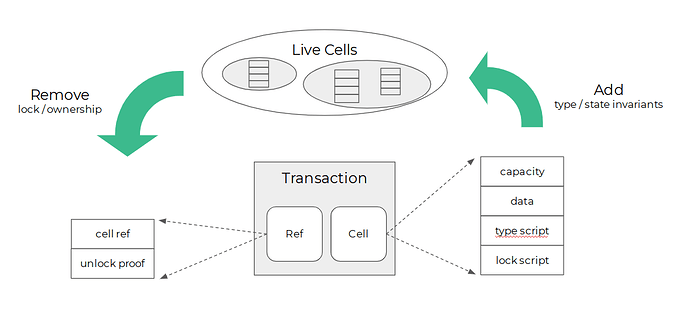

## 小白版

### 我要如何理解 Cell

在这里我使用一个“盒子模型”的方式，简单地介绍一下 CKB 的 Cell 模型，先别着急说这玩意太难懂了，我尽量简单地去进行说明：

首先我们把 Cell 想象成一个盒子或者是抽屉，而我们在存储 CKB，写入合约，存储未来的自定义代币，存数据都是需要这样一个盒子的。

那么这个盒子是由什么做成的呢？

盒子本身就是由 CKB 做的。

对，你没有听错，盒子就是由 CKB 做的！

假设，你的一个地址里面有 1000 个 CKB，其中就需要拿出 61 个 CKB 来做成盛放 CKB 的盒子，然后用这个盒子来装剩下的 939 个 CKB。你不要去管为什么是 61 个 CKB，你只需要知道目前做一个存 CKB 的盒子就是需要 61 个 CKB 即可。

所以你现在需要明白几件事情：

* 目前不存在一个地址内拥有大于 0 个小于 61 个 CKB 的情况，因为这根本做不成一个最小的盒子。
* 目前不管你是存 100 个 CKB 还是 10000 个 CKB，使用的都是由 61 个 CKB 做成的盒子。
* 这 61 个 CKB 还能转出来吗？当然没问题，因为盒子都是 CKB 做的，只要把盒子拆了就好了。
* 在 CKB 上转账的过程，就是拆盒子和造盒子的过程，转入有几笔就是拆了几个盒子，转出有几笔就是又造了几个盒子。

我知道这可能很难懂，但是如果可以，希望你可以多读几遍。

一旦你了解了整个过程，你也就明白了，为什么在未来 CKB 是稀缺的。

当然这还是不够的，接下来，我们还需要给这个盒子加上两个东西，一个叫做「锁」，一个叫做「标签」。

首先，「锁」非常好理解，既然我们存的 CKB 是一笔资产/财富，那么在这个盒子上，加上一把锁，防止别人盗取，这不是理所当然的嘛。

有了这把「锁」，那么能拆毁/打开这个盒子的人，就只有你一个人了，除非你的私钥已经泄露了。

然后，就是这个「标签」了，标签是用来干嘛的呢？

「标签」是用来标记这个盒子是用来存放什么的。

还记得我们上面说的用来存 CKB 的盒子吗？那么用来存 CKB 的盒子上的「标签」就是 CKB，然后做出一个这样的盒子需要 61 个 CKB。

那么用来装存入 Nervos DAO 的 CKB 的盒子上的「标签」是什么呢？

没错，这个盒子的「标签」就是 Nervos DAO。

特别注意，要做出一个「标签」是 Nervos DAO 的盒子，61 个 CKB 可不够用，我们需要用 102 个 CKB。

当我们理解了“盒子模型”，理解了“锁”和“标签”，那么我们基本上就已经了解了 Cell 模型了。

### 如何进一步理解 Cell

如果需要进一步理解 Cell 的话，这里就需要提到 Cell 的组成单位，Cell 共有四个部分组成：capacity（容量），lock script（锁定脚本），type script（类型脚本）和 data（数据）。

我们简单地理解一下这几个概念，还是利用上面提到的“盒子理论”：

* 容量：标注了这个盒子本身和盒子内一共有多少 CKB；
* 锁定脚本：规定了这个盒子的所有者是谁，也就是上面提到的「锁」；
* 类型脚本：规定了这个盒子属于什么类型，也就是上面提到的「标签」；
* 数据：实际描述了这个盒子内的所装的内容。

现在让我们来看一块最小的盒子，类型脚本就是 CKB，数据我们也不填入了。此时，容量需要占用 8 bytes，锁定脚本我们使用的加密算法为最常见的 secp256k1，这样锁定脚本需要占用 53 bytes。8 + 53 = 61，所以 1 个 Cell，最小的空间就是 61 CKB。

如果你是 Nervos 粉丝的话，你应该知道 Nervos DAO，一个用来抗二级发行稀释的系统合约，你存入 Nervos DAO 时，最少需要 102 CKB，这其实也意味着一个最小的 Nervos DAO 类型的 Cell 需要 102 bytes。具体组成就是：容量 8 bytes，锁定脚本 53 bytes，类型脚本 33 bytes，数据占 8 bytes，总和为 102 bytes。

是不是十分有趣？

这个时候让我们再深入一点点，仔细分析一下 Cell 的四个组成部分。

容量，标注的是盒子本身和盒子内所有东西总共的 CKB 的数量，这个很好理解。

锁定脚本，规定了这个盒子的所有权，决定了谁可以解锁然后转让这块盒子。然后我们现在用的加密算法是 secp256k1，比特币、以太坊用的都是这个加密算法。注意在 CKB 上，我们使用的加密算法是可以更改的，而且是不需要通过硬分叉就可以修改的，比特币和以太坊改变目前使用的加密算法都需要经过硬分叉。

这就好比是什么呢？目前我们使用的是一字锁在解锁我们的盒子，但实际上我们可以使用的锁的种类非常繁多，有一字锁、十字锁、密码锁、指纹锁等等，只要公开地向所有人公示各类锁的设计格式，那么它就是可以供每一位 CKB 生态用户使用的。

那类型脚本呢？类型脚本是用来标记这个盒子是属于什么类型的盒子。比如当前我们持有的 CKB，就标记为 CKB 的盒子；存入 Nervos DAO 的 CKB，可以标记为 Nervos DAO 的盒子；在我们可以在 CKB 上发行资产之后，我们就可以看到各式各样的盒子类型。

类型脚本其实还可以进一步的扩展，比如我们可以通过类型脚本将这个盒子标记为代售盒子，这个时候我们只需要在数据一项中，填入我们出售的盒子容积，盒子单价，出售有效期等一系列的信息，那么当别人看到这样的出售信息时，如果他愿意提供满足出售信息的内容，那么一笔盒子交易就可以实现了，有没有发现这其实就是在 CKB 上实现去中心化交易所的逻辑。

最后就是数据，数据中可以放入一切用与这个盒子相关的信息。数据中可以写入具体的加密算法、锁定脚本和类型脚本所需的相关信息等等。

> 我们使用“盒子理论”和“土地理论”去描述 CKB 和 Cell 模型，其实内在思路是完全一致的。注意，CKB 存储的数据是当前世界状态，也就是描述当前的盒子占多少空间，归属于谁，上面用的锁和贴的标签都是什么样的。而这些盒子曾经属于谁，是什么样的，都是历史数据，同样记录在 CKB 的链上，但是不会占用当前的 CKB 空间。同样这些历史数据是没有办法被消费使用的，就像我们去买盒子的时候，我们一定是和这个盒子当前的所有者交易，而不是和这个盒子的历史所有者交易。

---

## 进阶版

> 这依然是我目前认为最好的介绍 Cell 模型的文章，如果你有时间的话，建议你耐心地读完，一定会有所收获的
>
> 作者：Jan，原帖：[理解CKB的Cell模型](https://talk.nervos.org/t/ckb-cell/1562)，欢迎前往参与讨论

在设计CKB的时候，我们想要解决三个方面的问题：

1. [状态爆炸](https://talk.nervos.org/t/topic/1515)，引起的公地悲剧及去中心化的丧失；
2. [计算和验证耦合在了一起](https://talk.nervos.org/t/layer-1/1486)，使得无论是计算还是验证都失去了灵活性，难以扩展；
3. [交易与价值存储这两个目标的内在矛盾](https://github.com/nervosnetwork/rfcs/blob/master/rfcs/0015-ckb-cryptoeconomics/0015-ckb-cryptoeconomics.md#3-preservational-and-transactional-smart-contract-platforms)，Layer 2和跨链的出现将放大这种矛盾，并对Layer 1的经济产生非常负面的影响；

对这些问题没有回答，Layer 1就无法长久运行，区块链给我们的种种承诺自然也是无从谈起。这三个问题根植于区块链架构和协议设计的最深处，很难通过打补丁的方式来解决，我们必须从最基本的数据结构开始，重新审视问题的根源，寻找更合适的地基。

幸运的是，这个更合适的地基简单得令人感到幸福，而且一直就摆在我们眼前。

（本文会包含一些非常简单的代码，应该不会影响非技术读者阅读…）

### 从Bitcoin我们学到了什么

[Bitcoin把整个账本分割保存在了一个个UTXO里面](https://github.com/bitcoin/bitcoin/blob/master/src/primitives/transaction.h#L18)，UTXO是未花费交易输出(Unspent Transaction Output)的简写，实际上是交易中包含的输出(CTxOut)。CTxOut的结构非常非常的简单，只有两个字段：

```cpp
    class CTxOut
    {
    public:
        CAmount nValue;
        CScript scriptPubKey;
    ...
    }
```

每一个`CTxOut`代表了一个面值不同的硬币（Yay bit-”Coin”），其中`nValue`代表这个硬币的面值是多少，`scriptPubKey`是一段表示这个硬币的所有者是谁的脚本（通常包含了所有者的公钥），只有能提供正确的参数使这个脚本运行成功的人，才能把这个硬币“转让”给另外一个人。

为什么要给“转让”打引号？因为在转让的时候，并不是简单的把硬币中的`scriptPubKey`修改或是替换掉，而是会销毁和创造新的硬币（毕竟在数字的世界中销毁和创造虚拟硬币的成本很低）。每一个Bitcoin交易，都会销毁一批硬币，同时又创造一批硬币，新创造的硬币会有新的面值和新的所有者，但是被销毁的总面值总是大于等于新创造的总面值，以保证没有人可以随意增发。交易表示的是账本状态的变化。


这样一个模型的特点是：

1. 硬币（资产）是第一性的；
2. 所有者是硬币的属性，每一枚硬币有且仅有一个所有者；
3. 硬币不断的被销毁和创建；

是不是很简单？如果你觉得自己已经理解了Bitcoin和UTXO，恭喜你，你也已经理解了CKB和Cell!

### Cell

[Layer 1的关注点在状态](https://talk.nervos.org/t/layer-1/1486)，以Layer 1为设计目标的CKB设计的关注点很自然就是状态。Ethereum将交易历史和状态历史分为两个维度，区块和交易表达的是触发状态迁移的事件而不是状态本身，而Bitcoin协议中的交易和状态融合成了一个维度，交易即状态，状态即交易，正是一个以状态为核心的架构。

同时，CKB想要验证和长久保存的状态，不仅仅是简单的数字（`nValue`)，而是任何人们认为有价值的、经过共识的数据。显然Bitcoin的交易输出结构满足不了这个需求，但是它已经给了我们足够的启发：只需要将`nValue`一般化，把它从一个存放整数的空间变成一个可以存放任意数据的空间，我们就得到了一个更加一般化的”`CTxOut`"，[或者叫Cell](https://github.com/nervosnetwork/ckb/blob/develop/core/src/transaction.rs#L96):

```cpp
    pub struct CellOutput {
        pub capacity: Capacity,
        pub data: Vec<u8>,
        pub lock: Script,
        pub type_: Option<Script>,
    }
```

在Cell里面，`nValue`变成了`capacity`和`data`两个字段，这两个字段共同表示一块存储空间，`capacity`是一个整数，表示这块空间有多大（以字节数为单位），`data`则是保存状态的地方，可以写入任意的一段字节；`scriptPubKey`变成了`lock`，只是换了一个名字而已，表达的是这块共识空间的所有者是谁 - 只有能提供参数（例如签名）使得`lock`脚本成功执行的人，才能“更新”这个Cell中的状态。整个`CellOutput`占用的字节数必须小于等于`capacity`。CKB中存在着许许多多的Cells，所有这些Cell的集合形成了CKB完整的当前状态，在CKB的当前状态中存储的是任意的共同知识，不再仅仅是某一种数字货币。


交易依然表示状态的变化/迁移。状态的变化，或者说Cell内容的“更新”实际上也是通过销毁和创建来完成的（并不是真的去修改原有Cell中的内容）。每一笔交易实际上都会销毁一批Cells，同时创建一批新的Cells；新创造的Cells会有新的所有者，也会存放新的数据，但是被销毁的`capacity`总和总是大于等于新创建的`capacity`总和，由此保证没有人可以随便增发`capacity`。因为`capacity`可以转让，无法增发，拥有`capacity`等于拥有相应数量的共识状态空间，`capacity`是CKB网络中的原生资产。Cell的销毁只是把它标记为”已销毁“，类似Bitcoin的UTXO从未花费变为已花费，并不是从区块链上删掉。每一个Cell只能被销毁一次，就像每一个UTXO只能被花费一次。

这样一个模型的特点是：

1. 状态是第一性的；
2. 所有者是状态的属性，每一份状态只有一个所有者；
3. 状态不断的被销毁和创建；

所以说，Cell是UTXO的一般化(generalized)版本。

### Verify

仅仅有一块可以保存任意状态的空间还不够。Bitcoin之所以有价值，是因为[网络中的全节点会对每一笔交易进行验证](https://talk.nervos.org/t/dont-trust-verify/335)，使得所有用户都相信（并且知道别人也相信）Bitcoin协议中写下的规则（例如2100万的上限）会得到保证。共同知识之所以能成为共同知识，是因为[每个人都知道其他人认可这些知识](https://en.wikipedia.org/wiki/Common_knowledge_(logic))，区块链之所以能让知识变成共同知识，是因为每个人都知道其他人都能独立验证这些知识并由此产生认可。[任何共识的过程都包含了一系列的验证以及相互之间的反复确认，这个过程正是网络中共同知识形成的过程](https://mp.weixin.qq.com/s?__biz=MzUzNjEyNjMzMw==&mid=2247484123&idx=2&sn=3b8e7e44fa01274f18feee038ef5c1e0&chksm=fafbb4c9cd8c3ddf5ec60e98747824598544d8d94d879a58eb00f26f7067eed305b84e382038&scene=7&ascene=0&devicetype=android-27&version=2700033b&nettype=WIFI&abtest_cookie=BAABAAoACwASABMABQAjlx4AXZkeAMaZHgDRmR4A3JkeAAAA&lang=zh_CN&pass_ticket=Nwl0spbFDxbms6ptGi2JBtXd85cd4LTdSk8DR3nyRnk%3D&wx_header=1)。（需要注意的是，验证知识是相对事先确定的验证规则来说的，通过验证的知识不代表命题为真。）

我们如何验证Cell中保存的数据呢？这时候就需要Cell中的另一个字段`type`发挥作用了。`type`与`lock`一样，也是一段脚本，`type`定义了在`data`字段中保存的数据在状态迁移过程中必须要遵守的规则，是对状态的约束。CKB网络在共识的过程中，会在CKB-VM虚拟机中执行`type`脚本，验证新生成的Cell中保存的状态符合`type`中预先定义好的规则。满足同一种`type`约束的所有Cell，保存的是同一种[类型](https://en.wikipedia.org/wiki/Type_system)的数据。

举个例子，假设我们想定义一个叫做SatoshiCoin的代币（UDT，UserDefinedToken），它的状态迁移必须满足的约束是什么？只有两条：


1. 用户必须证明自己是输入代币的所有者；
2. 每一次转账的时候，输入的代币数量必须大于等于输出的代币数量；

第一条约束可以通过`lock`脚本来表达，[如果有兴趣可以查看这里的示例代码](https://github.com/nervosnetwork/ckb-ruby-scripts/blob/a75b5df8fdf833b7316bbd9213f73436401c86a5/udt/unlock.rb)，与Bitcoin的`scriptPubKey`原理相同；第二条约束，在Bitcoin中是在底层硬编码实现的，在CKB中则是通过`type`脚本来实现。每个Cell代表的SatoshiCoin数量是一种状态，我们首先定义其状态结构，即每个`type等于SatoshiCoin的Cell在`data`保存的状态为一个长度为8的字节串，代表的是序列化过后的数量：

```javascript
    {
        "amount": "Bytes[8]" // serialized integer
    }
```

`type`脚本在执行中，[需要读入交易中所有同类型的Cells（根据`type`字段可以判断），然后检查同一类型下的输入Cells中保存的`amount`之和大于等于输出Cells中保存的`amount`之和](https://github.com/nervosnetwork/ckb-ruby-scripts/blob/a75b5df8fdf833b7316bbd9213f73436401c86a5/udt/contract.rb#L74)。于是通过`lock`和`type`两个脚本，我们就实现了一个最简单的代币。

`lock`和`type`脚本不仅可以读取自身Cell中保存的状态，也能够引用和读取其它Cell中保存的状态，所以CKB的编程模型是一个[有状态的编程模型](https://en.wikipedia.org/wiki/State_(computer_science))。值得指出的是，Ethereum的编程模型之所以强大，更多是因为它有状态，而不是因为它的有限图灵完备。我们可以把`type`脚本保存在一个独立的Cell里面，然后在每一个SatoshiCoin Cell的`type`字段引用它，这样做的好处是相同的`type`脚本只需要一份空间保存，像这样[保存数字资产定义的Cell我们把它叫做ADC（Asset Definition Cell）](https://talk.nervos.org/t/first-class-asset/405)。SatoshiCoin的另一个特点是，具体的资产与所有者之间的记录，分散保存在多个独立的Cell里面，这些Cell可以是开发者提供给用户的，也可以是用户自己拥有的，甚至是租来的。只有在共识空间所有权明确的情况下，所有者才能真正拥有共识空间里面保存的资产（任何数据都是资产）。在CKB上，因为用户可以真正拥有共识空间，所以用户可以真正拥有数字资产（当你能真正拥有土地的时候，才能真正拥有土地上的房子）。

Cell是抽象的状态验证模型，Cell提供的存储(`data`)没有任何内部结构，Cell支持任意的状态验证规则(`type`)和所有权验证规则（`lock`)，我们可以在Cell模型上模拟UTXO模型（就像上面的SatoshiCoin），也可以在Cell模型上构建Account模型。`lock`脚本在验证交易输入的时候执行，确保用户对输入有所有权，有权销毁输入的Cells；`type`脚本在验证交易输出的时候执行，确保用户生成的新状态符合类型约束，正确生成了新的Cells。由于状态模型迥异，以及计算和验证分离，CKB的编程模型与Ethereum的编程模型有非常大的不同，什么是CKB编程模型上的最佳实践还需要大量的探索。



### 通用验证网络(General Verification Network)

Bitcoin是一个验证网络（Verification Network）。在转账时，用户告诉钱包/本地客户端转账的数量和收款人，钱包根据用户提供的信息进行计算，在本地找出用户拥有的数量合适的硬币（UTXO），同时产生一批新的硬币，这些硬币有些归收款人所有，有些是找零。之后钱包将这些花费掉的硬币和新生成的硬币打包到一个交易里面，将交易广播，网络对交易验证后将交易打包到区块里面，交易完成。在这个过程中，网络中的节点并不关心老的状态（被销毁的硬币）是怎样被搜索出来的，也不关心新的状态（新硬币）是怎样生成出来的，只关心这些硬币的面值总和在交易前后没有改变。在转账过程中，计算在用户端完成，因此用户在交易发送时就能确定计算结果（新状态）是什么。

Ethereum是一个通用计算网络（General Computation Network）。在使用DApp的时候，用户告诉钱包/本地客户端想要进行的操作，钱包将用户的操作请求原样打包到交易里面，并将交易广播。网络节点收到交易之后，根据区块链的当前状态和交易包含的操作请求进行计算，生成新的状态。在这个过程中，计算在远端完成，交易结果（新状态）只有在交易被打包到区块之后才能确定，用户在交易发送的时候并不能完全确定计算结果。


（图中，上面是Ethereum的流程，交易中包含的是用户请求或者说事件/Event；下面是Bitcoin/CKB的流程，交易中包含的是链下生成的状态/State。）

CKB是一个通用验证网络（General Verification Network）。在使用DApp的时候，用户告诉钱包/本地客户端想要进行的操作，钱包根据当前状态和用户的操作请求进行计算，生成新的状态。在这个过程中，计算在用户端完成，计算结果（新状态）在交易发出的时候就已经确定了。

换句话说，Bitcoin和CKB都是先计算再共识，而Ethereum是先共识再计算。有趣的是，在许可链架构里面也有同样派别之分：[Fabric](https://www.hyperledger.org/projects/fabric) 是先计算再共识，而[CITA](https://github.com/cryptape/cita) (实际上不仅仅是许可链)是先共识再计算。（思考题：那一种架构更适合许可链？）

计算与验证的分离同时也使得Layer 2与Layer 1自然分开了。Layer 1关心的是新的状态是什么，并不关心新的状态是如何得到的。无论是state channel，plasma还是其他Layer 2方案，其实质都是在链外进行计算，在特定时候将最终状态提交到Layer 1上进行验证。

|          | General | Verification Only |
| -------- | ------- | ----------------- |
| Bitcoin  | No      | Yes               |
| Ethereum | Yes     | No                |
| CKB      | Yes     | Yes               |

### 为什么更好？

现在我们得到了一个非常不同的基础数据结构，在这个结构之上我们设计了独特的经济模型，这个结果真的更好吗？回顾一开始的三个问题也许能给我们一些启示。

`capacity`是原生资产，受到预先确定的发行规则约束，其总量有限。`capacity`同时又是状态的度量，有多少`capacity`，CKB上就能放多少数据，CKB状态空间的最大值与`capacity`总量大小相等，CKB上保存的状态不会超过`capacity`总量。这两点决定了，CKB不会有状态爆炸的问题。在`capacity`发行规则适当的情况下，网络应该可以长久的保持去中心化的状态。每一个Cell都是独立状态，有明确的所有者，[原本属于公共资源的状态空间被私有化](https://en.wikipedia.org/wiki/Tragedy_of_the_commons#Privatization)，宝贵的共识空间可以被更有效的使用。

CKB是一个通用验证网络，计算和验证得到了分离，各自的灵活性和扩展性都得到了提高。[更多的计算被推到了用户端执行](https://en.wikipedia.org/wiki/Edge_computing)，计算发生在离场景和数据更近的地方，数据处理的方式更灵活，工具更多样。这也意味着，在CKB架构中，钱包是一个能做的事情更多，能力更大的入口。在验证端，由于计算结果已经完全确定，交易的依赖分析变得非常轻松，交易的并行处理也就更加容易。

在基于Cell建立的经济模型中，存储的使用成本与占用空间大小和占用时间成正比，矿工可以为提供共识空间获得相应的收益。CKB提供的Utility是安全的共识空间，价值来自于其安全性和可用性（accessability），并不是来自于交易处理能力（TPS），与Layer 2负责交易的特点相辅相成，在分层网络和跨链网络中具有更好的价值捕获能力。

### CKB is NOT …

#### IPFS

CKB是一种存储这一点可能会使人感到迷惑：”这不就是IPFS/Filecoin/[任何分布式存储]吗？“

CKB不是分布式存储，关键的区别在于，分布式存储只有存储，没有验证，也就不会对其存储的数据形成共识。分布式存储的容量可以随着存储技术的增长而等比例的增长，而CKB的容量则收到形成全球共识效率的限制。

CKB也不需要担心容量不够。在Layer 2以及分层技术成熟的阶段，极端情况下，Layer 1上可能只需要放一个merkle root就足够了。在Layer 1上进行验证所需要的状态，也可以通过交易提交给节点，节点通过merkle proof验证状态是有效的，在此基础之上再验证状态迁移是有效的，这个方向已经有一些研究。

#### Qtum

Qtum是尝试在UTXO模型上引入更强大的智能合约的先行者之一，具体做法是保持Bitcoin原有的UTXO模型不变，在其上引入账户抽象层（Account Abstraction Layer），支持EVM或是X86虚拟机。在Qtum中，Bitcoin的验证是第一层，EVM的计算是第二层（注意这是一个区块连协议内部的分层，不是Layer 1和Layer 2）。Qtum对UTXO中`scriptPubKey`的处理逻辑进行修改，以实现在交易打包后，将Bitcoin Transaction中携带的请求传递给EVM进行执行的效果。Qtum将Bitcoin和Ethereum的执行模型桥接到了一起，网络节点先验证交易输入部分（同Bitcoin），再调用合约进行计算（同Ethereum），状态分散在UTXO模型和EVM自己的状态存储两个地方，整体架构比较复杂。

CKB所做的是继承Bitcoin的架构思路，对UTXO模型进行一般化(Generalization)处理得到Cell模型，整体架构保持了一致性以及Bitcoin的简洁。CKB上的所有状态都在Cell里面，计算在链下完成（类似Bitcoin），网络节点只做验证。