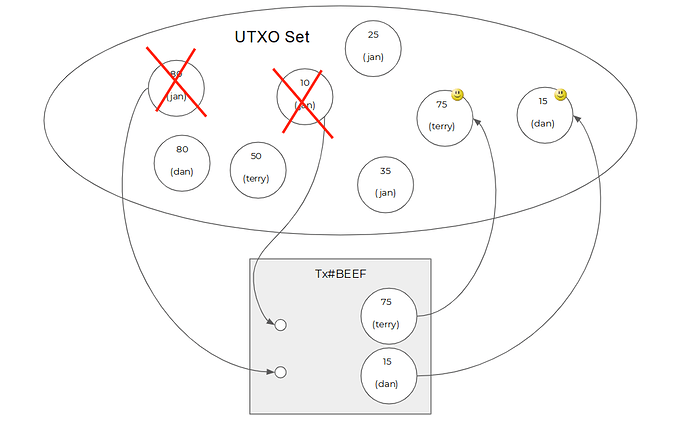
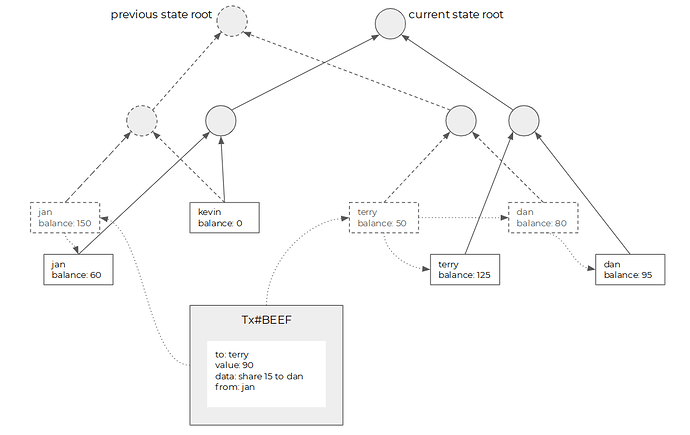

## CKB 的含义

CKB 是 Nervos Network 的 Layer1 层的原生 Token 的名称。对于 CKB 这个缩写，目前主要有两种同样合理的释义：

第一种，CKB 是（**Common Knowledge Base** 共同知识库）的缩写，所谓的共同知识就是每个人都能知道，也知道其他人几乎都知道的知识。在区块链世界里，共同知识指的是经过全球共识验证并且网络中的所有人接受的「状态」。

第二种，CKB 是（**Common Knowledge Byte** 共同知识字节）的缩写，前面的“共同知识”同第一种解释是一样的，而最后的 Base 被替换成为了 Byte 字节（字节：是计算机内用于计量存储容量的一种计量单位），Byte 赋予了 CKB 实际的物理意义，演变成为了 CKByte，CKByte 是所有人用来存储共同知识的物理空间，所以 1 CKB = 1 Byte。

Nervos CKB 是 Layer1 的区块链，储存所有类型的共同知识，而不像比特币一样只局限于货币，CKB 还可以存储有价值的密码学证明，为更上层（Layer2）的协议提供安全性。

比特币和 Nervos CKB 都是共同知识的存储和验证系统。比特币的是 UTXO 集，透过其脚本进行验证。NervosCKB 泛化了比特币的数据结构和脚本功能，将其全局状态存储为一组可编程的单元（我们称之为 Cell），并通过虚拟机来运行用户自定义的图灵完备脚本来验证他的状态转换。

## CKB 是什么？

## 小白版

### 共同知识库

CKB 是“共同知识库”。

“共同知识”是需要经过验证的，正确的，并在一群人中达成共识的知识。比如全人类都遵守在数学领域中“1+1=2”这个最基本设定，比如编程语言都需要认可“与/and”“或/or”“非/not”这些三种基本的逻辑门，这些共同知识是团队协作、社会协作、全人类协作的基础。只有基于这一系列的共同知识，我们才会在这个基础上逐渐演化出民族、宗教、国家、团队、企业、文化、经济等等社会形式，而这些社会形式的扩展和发展，也都是基于新的共同知识在不断地形成、认可和固定。

可以说共同知识的形成和传递是人类社会的基础和关键。

而区块链在一定程度上就是一个共同知识库。区块链是一条数据链，这里面的数据不仅包含了我们常提及的数字资产和智能合约，还包含了加密算法，隐私算法以及未来所有可能放到链上的逻辑或功能。而这些数据会一次一次地被各个节点验证正确性，最终经过所有节点的确认并达成一致共识，区块链的整个过程在慢慢被人们理解和相信的过程中，逐渐以一种非常低的成本沉淀为所有目前正在使用或者未来即将使用这条区块链的人的共同知识。

目前我们对区块链的认知和使用的水平还是处于一个非常早期的水平，最主要还是数字资产的发行和流转以及一些简单的智能合约逻辑，我相信随着技术的进步，新的验证逻辑在区块链上的实现，会有更多更复杂的共同知识在区块链上沉淀下来。

因此我们可以说：促进共同知识的形成和传递才是区块链的核心价值所在。

这也是 CKB 的定位， CKB 不希望成为一台世界计算机，而是希望成为人类的共同知识库。

### CKB 是物理资源

上面我们已经谈到了 CKB 的目标是成为人类的共同知识库。在这个设定下，Nervos 团队发行了 CKB 这个 Token，然后标榜 CKB 就是所谓的共同知识库，我想这样的推论断然是站不住脚的。

CKB 可以称之为共同知识库，是因为 CKB 真实地绑定了区块链上实际的物理资源的，每 1 个 CKB 都对应着 Nervos CKB 网络上 1 Byte 的存储空间。

首先我们需要解答一个问题，为什么存储空间才是区块链上的共同知识库？

区块链最常见的解释是，区块链是一个不可篡改的分布式数据库。而区块链之所以可以成为一个不可篡改的分布式数据库，是因为区块链上的这些数据是经过全球无数台，分属于不同人、不同团体、不同机构的计算机共同验证通过的。在区块链在实际运行上其实就是无数台计算机执行相同的内容而已，而对于任意一台计算机，我们可以大致将计算机资源分为：带宽、CPU、内存、硬盘。

我们进一步分析一下这些计算机资源，带宽：用于接收和传输数据；CPU：用于处理和计算数据；内存：用于暂存当前正在处理的数据；硬盘：用于存储已经处理好的需要长久保存的数据。

从我们使用电脑的角度来看，带宽、CPU、内存其实都属于瞬时资源，通常情况下在你使用这些资源的同时，它会实时地恢复，比如当前的带宽是 1M/s，它在任何时候都是 1M/s，不会因为你下载了一个文件而减少，1M/s 决定的只是你瞬时下载速度的上限。而硬盘则属于非瞬时资源，你在电脑中存储了一个文档或者一张照片，它是长时间地占据硬盘空间的，在接下的时间内，你可以随时再调用查看它，当然你的硬盘空间始终是需要消耗掉一部分的，除非你选择彻底删除这个文件或者照片，这部分存储空间才可能会被再次使用，存入新的数据。

让我们回到上面的问题，区块链上所有被验证过的、正确的，且被人们相信的数据，也就是共同知识，最终是被存储在了什么地方？不是带宽、不是CPU、不是内存，而是硬盘代表的存储空间。所以 CKB 对应的存储空间，才可能真正地成为区块链上的共同知识库。

就是这样一个简单的道理，但目前只有 Nervos 一个项目是真正朝着这个方向去努力的。

## 进阶版

如果 [Layer 1 的关注点应该是状态而不是计算](https://talk.nervos.org/t/layer-1/1486/4), 在设计 Layer 1 区块链的时候，我们就需要先理解什么是区块链的状态。理解了状态是什么，我们才能理解什么是状态爆炸，才能理解是什么 CKB。

### 状态和历史

区块链网络中的每一个全节点，在网络中运行一段时间之后都会在本地存储上留下一些数据，我们可以按照历史和现在把它们分为两类：

* 历史 - 区块数据和交易数据都是历史，历史是从Genesis到达当前状态的路径。
* 状态（即现在） - 节点在处理完从Genesis到当前高度的所有区块和交易后形成的最终结果。状态随着区块的增加一直处于变化之中，交易是造成变化的原因。

共识协议的作用是通过一系列的消息交换，保证每一个节点看到的当前状态是相同的，而实现这个目标的方式是保证每一个节点看到的历史是相同的。只要历史相同（即所有交易的排序相同），处理交易的方式相同（把交易放在相同的确定性虚拟机里面执行），最后看到的当前状态就是相同的。当我们说“区块链具有不可篡改性”的时候，指的是区块链历史不可篡改，相反，状态是一直在变化的。

有趣的是，不同的区块链保存历史和状态的方式不同的，其中的差异使得不同的区块链形成了各自的特点。由于这篇文章讨论的话题是状态，而影响状态的历史数据主要是交易（而不是区块头），接下来的讨论历史的时候会侧重交易，忽略区块头。

### Bitcoin 的历史和状态

Bitcoin 的状态，指的是 Bitcoin 账本当前的样子。Bitcoin 的状态是由一个个 UTXO（尚未花费的交易输出）构成的，每个 UTXO 代表了一定数量的 Bitcoin，每个 UTXO 上面写了一个名字（scriptPubkey），记录这个UTXO的所有者是谁。如果要做一个比喻的话，Bitcoin 的当前状态是一个装满了金币的袋子，每个金币上刻着所有者的名字。

Bitcoin 的历史由一连串的交易构成，交易内部的主要结构是输入和输出。交易更改状态的方法是，把当前状态中包含的一些UTXO（交易输入引用的那些）标记为已花费，从 UTXO 集合中移出，然后把一些新的 UTXO（这个交易的输出）添加到 UTXO 集合里面去。

可以看出，Bitcoin 交易的输出（TXO，Transaction Output）正是上面说的 UTXO，UTXO 只不过是一种处于特殊阶段（尚未花费）的 TXO。因为构成 Bitcoin 状态的组件(UTXO)，同时也是构成交易的组件(TXO)。由此 Bitcoin 有一个奇妙的性质：任意时刻的状态都是历史的一个子集，历史和状态包含的数据类型是同一维度的。交易的历史（所有被打包的交易的集合，即所有产生过的 TXO 的集合）即状态的历史（每个区块对应的 UTXO 集合的集合，也是所有产生过的 TXO 的集合）， Bitcoin 的历史只包含交易。

在 Bitcoin 网络中，每一个区块，每一个 UTXO 都要持续占用节点的存储空间。目前 Bitcoin [整个历史的大小（所有区块加起来的大小）大约是 200 G](https://www.blockchain.com/en/charts/blocks-size)，而[状态的大小只有~ 3 G(由 ~ 5000 万个 UTXO 组成)](https://statoshi.info/dashboard/db/unspent-transaction-output-set)。Bitcoin 通过对区块大小的限制很好的管理了历史的增长速度，由于其历史和状态之间的子集关系，状态数据大小必然远小于历史数据大小，因此状态增长也间接的受到区块大小的管理。

### Ethereum 的历史和状态

Ethereum 的状态，也叫做“世界状态”，指的是 Ethereum 账本当前的样子。Ethereum 的状态是由账户构成的一棵 Merkle 树（账户是叶子），账户里面不仅记录了余额（代表一定数量的 ether），还有合约的数据（例如每一只加密猫的数据）。 Ethereum 的状态可以看作一个大账本，账本的第一列是名字，第二列是余额，第三列是合约数据。

Ethereum 的历史同样由交易构成，交易内部的主要结构是

* to - 另一个账户，代表交易的发送对象
* value - 交易携带的ether数量
* data - 交易携带的任意信息

交易更改状态的方法是，EVM找到交易发送的目标账户，

1. 根据交易的 value 计算目标账户的新余额；
2. 将交易携带的 data 作为参数传递给目标账户的智能合约，运行智能合约的逻辑，在运行中可能会修改任意账户的内部状态生成新的状态；
3. 构造新的叶子存放新的状态，更新状态 Merkle 树

可以看出，Ethereum 的历史和交易结构与 Bitcoin 相比有非常大的不同。Ethereum 的状态是由账户构成的，而交易是由触发账户变动的信息构成，状态和交易中记录的是完全不同类型的数据，二者之间没有超集和子集的关系，**历史和状态所包含的数据类型是两个维度的**，交易历史大小与状态大小之间没有必然的联系。交易修改状态后，不仅会产生新的状态（图中实线框的叶子），而且会留下旧的状态（图中虚线框的叶子）成为历史状态，因此 Ethereum 的历史不仅仅包含交易，还包含历史状态。因为历史和状态属于不同的维度，Ethereum 区块头中不仅仅包含交易的 merkle root, 也需要显式包含状态的 merkle root。

Ethereum 中每一个区块，每一个账户都会持续占用节点的存储空间。Ethereum 节点在同步的时候有多种模式，在 Archive 模式下所有的历史和状态都会保存下来，其中历史包括历史交易和历史状态，[所有数据加起来大小超过了 2 TB](https://etherscan.io/chartsync/chainarchive)；在 Default 模式下，历史状态会被裁剪掉，本地只保留历史交易和当前状态，[所有数据加起来大约是 170 G](https://etherscan.io/chartsync/chaindefault)，其中[交易历史大小是 150 G，当前状态大小是 10 G](http://webcache.googleusercontent.com/search?q=cache:http://didtheethereumblockchainreach1tbyet.5chdn.co/)。Ethereum中所有的开销管理都被统一到 gas 计费模型之下，[交易的大小需要消耗对应的 gas](https://ethereum.stackexchange.com/questions/1106/is-there-a-limit-for-transaction-size)，而每一条 EVM 指令消耗的 gas，不仅考虑了计算开销，[也将存储开销考虑在内](https://medium.com/coinmonks/storing-on-ethereum-analyzing-the-costs-922d41d6b316)。通过每个区块的 gaslimit，间接限制了历史和状态的增长速度。

ps. 常见的一个误解是，Ethereum 的“区块链大小”已经超过1T了。从上面的分析我们可以看到，“区块链大小”是一个非常模糊的定义，如果把历史状态算进去，确实超过了，但是对于全节点来说，把历史状态删掉没有任何问题，因为只要有 Genesis 和交易历史，任意时刻的历史状态都可以重新被计算出来（不考虑计算需要的时间）。真正有意义的数据，是全节点必须的数据的大小，Bitcoin 是 200G，Ethereum 是 170G，两者是基本相同的，而且在平均配置的云主机上都能装下，因此人们观察到的 [Ethereum 全节点减少](https://www.trustnodes.com/2019/01/09/bitcoin-overtakes-ethereum-in-node-numbers)并不是由于存储增加导致的（根本原因是同步时的计算开销，这里不展开了）。考虑到 Ethereum 的历史长度（当前区块的 timestamp 减去 genesis 的 timestamp）不到 Bitcoin 的一半，可以看出 Ethereum 的历史和状态大小增长更快。

### CKB 的状态

在 CKB 中 1 CKB = 1 Byte，每一个 CKB 都代表了 1 Byte 的状态存储空间，而状态存储空间会收到 CKB 的经济模型中 CKB 发行的限制，因此 CKB 可以有效地限制区块链状态爆炸的问题。